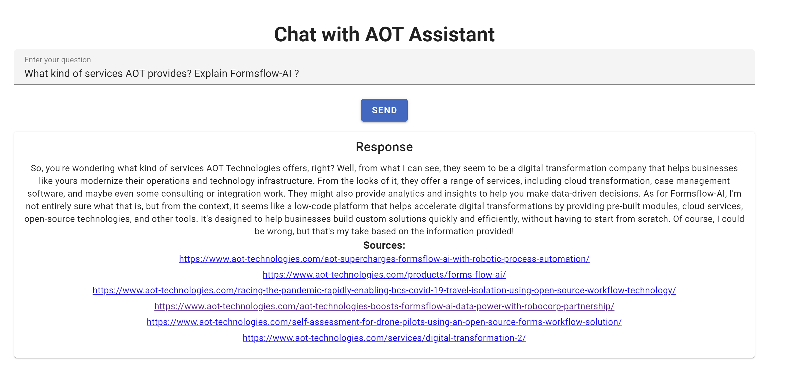

# RAG-Projects

# 1. AOT Assistant - RAG Application

This project is a learning exercise to understand the structure and implementation of a Retrieve and Generate (RAG) application. It consists of a Node.js backend that integrates with the Ollama API to query an LLM, and a Vue.js frontend styled with Vuetify to interact with the backend.

## Screenshot

Below is a screenshot of the chat interface of the AOT Assistant application:

